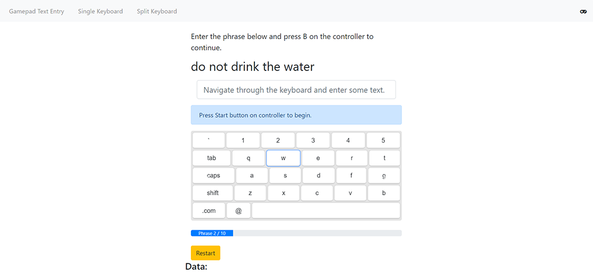

# Gamepad Text Entry

A text entry web application built as part of a human-computer interaction (HCI) experiment. The web application interfaces to any gaming controller using the Gamepad API to allow the user to navigate through an onscreen virtual keyboard using the left joystick. The right joystick is used to switch between two halves of a QWERTY keyboard. The experiment aimed to study the performance of using a dual joystick in combination with a half-QWERTY layout (reducing cognitive load) for such a method of text entry (ie. gaming consoles).

This project was generated with [Angular CLI](https://github.com/angular/angular-cli) version 6.0.8.

## Development server

Run `ng serve` for a dev server. Navigate to `http://localhost:4200/`. The app will automatically reload if you change any of the source files.

## Code scaffolding

Run `ng generate component component-name` to generate a new component. You can also use `ng generate directive|pipe|service|class|guard|interface|enum|module`.

## Build

Run `ng build` to build the project. The build artifacts will be stored in the `dist/` directory. Use the `--prod` flag for a production build.

## Running unit tests

Run `ng test` to execute the unit tests via [Karma](https://karma-runner.github.io).

## Running end-to-end tests

Run `ng e2e` to execute the end-to-end tests via [Protractor](http://www.protractortest.org/).

## Further help

To get more help on the Angular CLI use `ng help` or go check out the [Angular CLI README](https://github.com/angular/angular-cli/blob/master/README.md).
